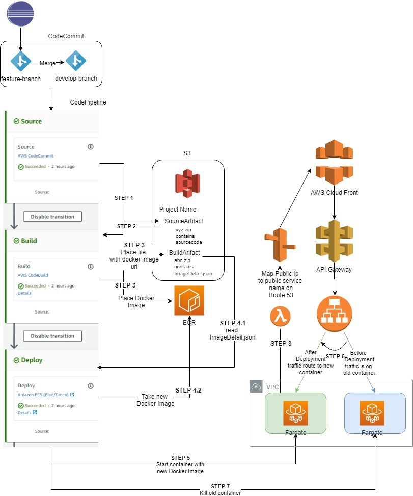

# aws-ec2-codedeploy-pipeline-startstopserver 🐳


[](https://github.com/tquangdo/aws-ec2-codedeploy-pipeline-startstopserver/issues/new)


## reference
[youtube](https://www.youtube.com/watch?v=KoNWlnx6E1I)

## AWS IAM Role
1. ### for EC2
    - role name=`DTQRoleEC2`
    - policies=`AmazonS3FullAccess` & `AmazonEC2RoleforAWSCodeDeploy`
1. ### for CodeDeploy
    - role name=`DTQRoleCodeDeploy`
    - policies=`AWSCodeDeployRole`

## AWS EC2
- tag name=`DTQEC2CICD`
- role=`DTQRoleEC2`
- bootstrap bash=
- 1. `Choose User Data: for installing required packages.` from https://github.com/prabhakar2020/aws_code_deploy#steps-for-aws-code-deploy-using-s3-as-source
> => ERR without change region like: `wget https://aws-codedeploy-us-east-1.s3.us-east-1.amazonaws.com/latest/install`!!!
- 2. https://github.com/justmeandopensource/aws/blob/master/pipeline-demo/quick-ref.md#bootstrap-code-for-installing-codedeploy-agent-on-linux
> replace region to `us-east-1` like: `aws s3 cp s3://aws-codedeploy-us-east-1/latest/install .`

## AWS CodeDeploy
1. ### application
    - application name=`DTQCodeDeployCICD`
    
1. ### deployment group
    - group name=`DTQCodeDeployGrpCICD`
    - role=`DTQRoleCodeDeploy`
    - EC2=`DTQEC2CICD`
    
    - uncheck `Enable load balancing`

## AWS CodePipeline
1. ### config
    - name=`DTQPipelineCICD`
    - add src:
    > src from fork repo: `https://github.com/tquangdo/aws_codedeploy_using_github`
    ---
    
    - add build: `skip`
    - add deploy:
    
    - need to wait for deploying for quite long time
    
    > if select `S3` instead of `github`
    - select S3 object=`https://github.com/tquangdo/aws_codedeploy_using_github/blob/master/SampleApp_Linux.zip`
    - with `SampleApp_Linux.zip` get by `curl -O http://s3.amazonaws.com/aws-codedeploy-us-east-1/samples/latest/SampleApp_Linux.zip`
    
1. ### result
    1. #### NG!!!
        - ERR:
        
        - reason: `wget https://aws-codedeploy-ap-south-1.s3.ap-south-1.amazonaws.com/latest/install` can NOT install code deploy agent!!!
        ```rb
        ...
        res = run_command(cmd, 'codedeploy-agent', 'status')
        ```
    1. #### OK (💣💣💣!!!)
        
        - change `https://github.com/tquangdo/aws_codedeploy_using_github/blob/master/index.html`
        ```html
        <h1>Waaw, Congratulations Prabhakar</h1>
        ->
        <h1>DTQ!!!</h1>
        ```
        - pipeline will auto refresh CICD
        
        ---
        

## note: all provider list in deploy stage
1. ### CloudFormation
    - action mode has 4 items: `create/update stack` & `delete stack` & `replace stack` & `create/replace change set` & `execute change set` 
    
1. ### CodeDeploy
    - this repo! (more additional 2 items: `Input artifacts` & `Variable namespace`)
    
1. ### EB
    
1. ### ECS
    
1. ### ECS blue green
    1. #### AWS console
        
    1. #### reference
        - REF1:
        
        ---
        - REF2: the steps are explained in: [medium](https://medium.com/@shashank070/in-my-previous-blog-i-have-explained-how-to-do-initial-checks-like-code-review-code-build-cddcc21afd9f)
        
1. ### S3
    
