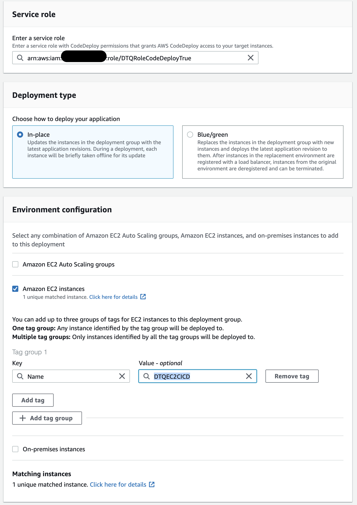
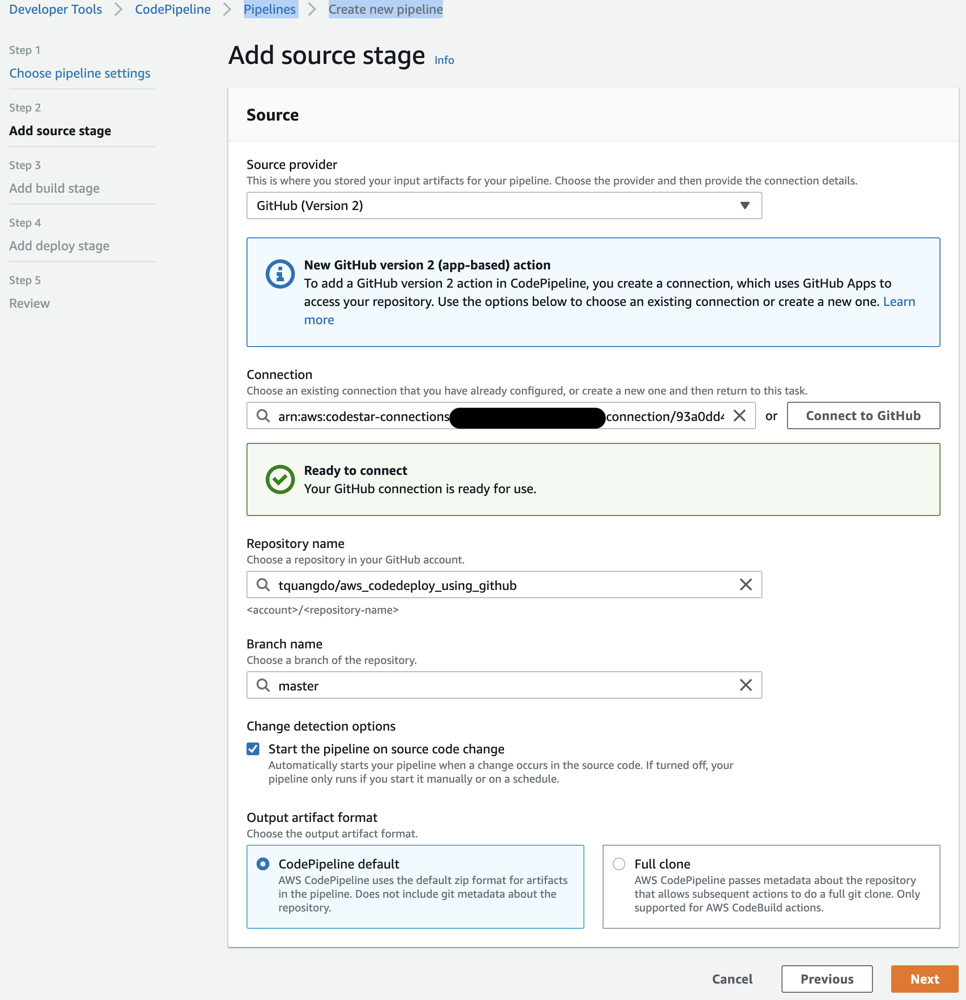

# aws-ec2-codedeploy-pipeline-startstopserver 🐳


[](https://github.com/tquangdo/aws-ec2-codedeploy-pipeline-startstopserver/issues/new)


## reference
[youtube](https://www.youtube.com/watch?v=KoNWlnx6E1I)

## AWS IAM Role
### 1) for EC2
- role name=`DTQRoleEC2`
- policies=`AmazonS3FullAccess` & `AmazonEC2RoleforAWSCodeDeploy`
### 2) for CodeDeploy
- role name=`DTQRoleCodeDeploy`
- policies=`AWSCodeDeployRole`

## AWS EC2
- tag name=`DTQEC2CICD`
- role=`DTQRoleEC2`
- bootstrap bash=
- 1. `Choose User Data: for installing required packages.` from `https://github.com/prabhakar2020/aws_code_deploy#steps-for-aws-code-deploy-using-s3-as-source`
- 2. https://github.com/justmeandopensource/aws/blob/master/pipeline-demo/quick-ref.md#bootstrap-code-for-installing-codedeploy-agent-on-linux
> replace region to `us-east-1` like: wget https://aws-codedeploy-us-east-1.s3.us-east-1.amazonaws.com/latest/install

## AWS CodeDeploy
### 1) application
- application name=`DTQCodeDeployCICD`

### 2) deployment group
- group name=`DTQCodeDeployGrpCICD`
- role=`DTQRoleCodeDeploy`
- EC2=`DTQEC2CICD`

- uncheck `Enable load balancing`

## AWS CodePipeline
- name=`DTQPipelineCICD`
- add src:
> src from fork repo: `https://github.com/tquangdo/aws_codedeploy_using_github`
---

- add build: `skip`
- add deploy:

- need to wait for deploying for quite long time

> if select `S3` instead of `github`
- select S3 object=`https://github.com/tquangdo/aws_codedeploy_using_github/blob/master/SampleApp_Linux.zip`
- with `SampleApp_Linux.zip` get by `curl -O http://s3.amazonaws.com/aws-codedeploy-us-east-1/samples/latest/SampleApp_Linux.zip`

### result
#### 1) NG!!!
- ERR:

- reason: `wget https://aws-codedeploy-ap-south-1.s3.ap-south-1.amazonaws.com/latest/install` can NOT install code deploy agent!!!
```rb
...
res = run_command(cmd, 'codedeploy-agent', 'status')
```
#### 2) OK (💣💣💣!!!)

- change `https://github.com/tquangdo/aws_codedeploy_using_github/blob/master/index.html`
```html
<h1>Waaw, Congratulations Prabhakar</h1>
->
<h1>DTQ!!!</h1>
```
- pipeline will auto refresh CICD

---

